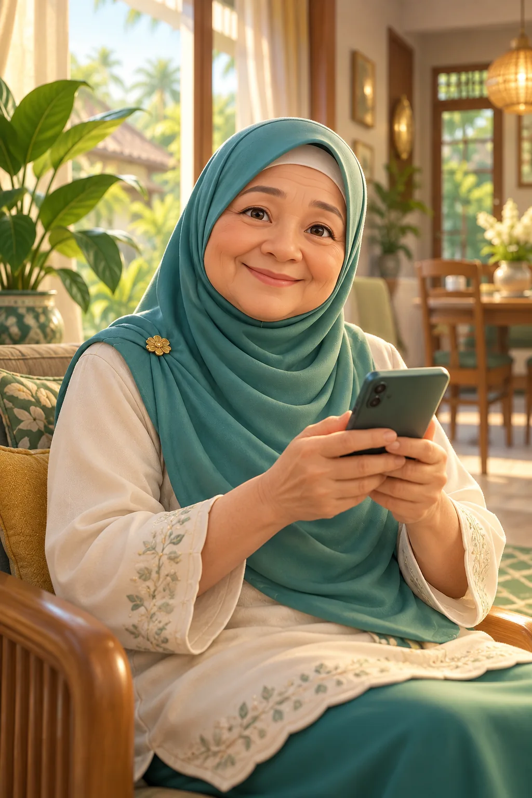
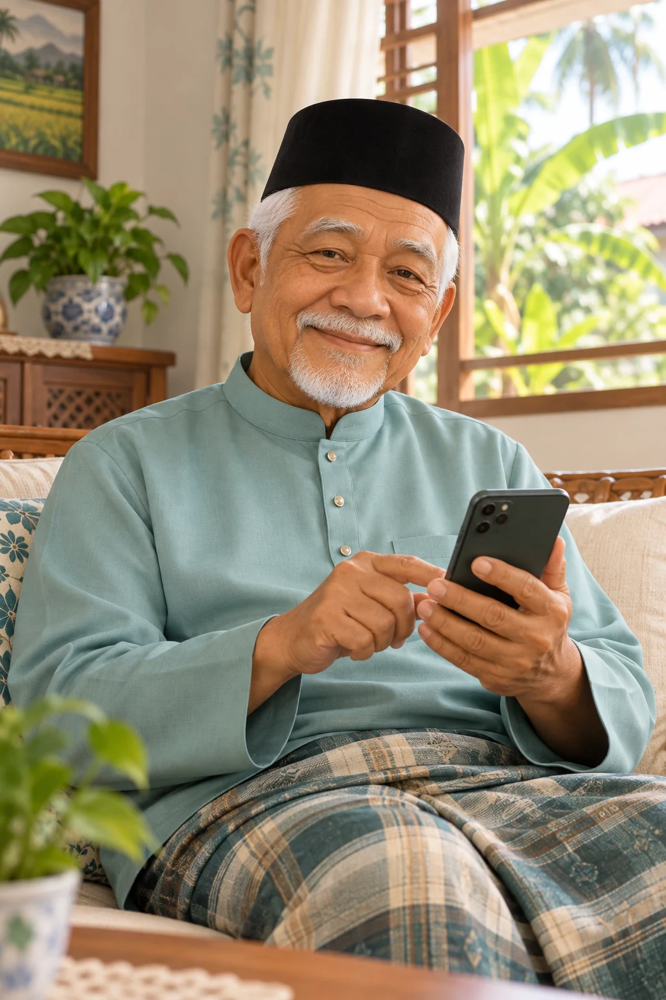
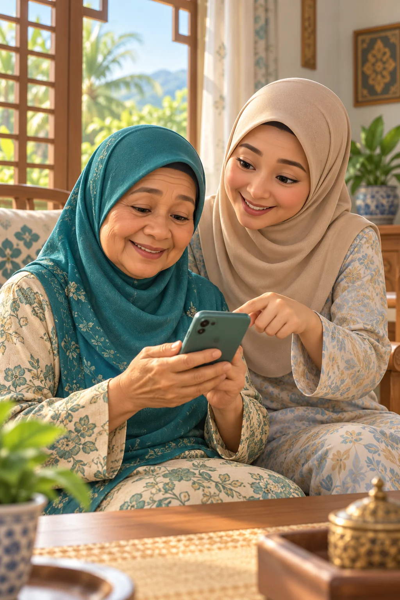
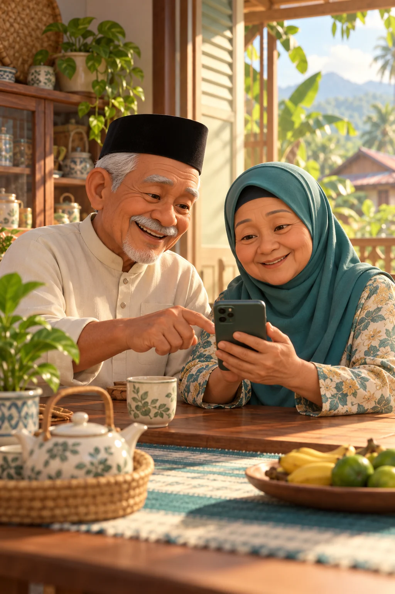

# Silver App elderly image options

All four illustrations are original generated artwork for the Kedah Silver Economy prototype. The current welcome screen still uses `silver-app-welcome.webp`. The three additional files are ready for comparison or use elsewhere in the root Codex version. Each is 1024 × 1536 pixels in WebP format.

| Option | Suggested use | Alt text |
| --- | --- | --- |
| [Current welcome](silver-app-welcome.webp) | Existing app welcome screen | An older Malay woman smiles while using a smartphone at home. |
| [Older man](silver-app-welcome-man.webp) | Alternative welcome image | An older Malay man smiles while using a smartphone in his living room. |
| [Family support](silver-app-family-support.webp) | Family helper or shared intake screen | An older Malay woman and her daughter explore options together on a smartphone. |
| [Older couple](silver-app-couple.webp) | Community or household support screen | An older Malay couple look at a smartphone together at their kitchen table. |

## Previews

## Generation prompts

Generated with the built-in imagegen tool, one prompt per image. Shared direction: original warm 3D animated family-film-style illustration for an elderly-first Kedah mobile app; polished soft rendering, natural mature features, warm daylight, muted teal and cream accents, no readable screen text, logos or watermark.

- **Older man:** A dignified Malay man around 70 using a smartphone confidently in a bright modest Kedah living room, seated and smiling, with greenery outside the window. Vertical portrait with the phone clearly visible and room around his head and shoulders.
- **Family support:** An older Malay woman around 72 holds a smartphone while her adult daughter gently points to the screen in a bright Kedah home. Both are visible from the waist up; a calm everyday moment with warm smiles.
- **Older couple:** An older Malay couple around 70 sit at their kitchen table and use a smartphone together, in a welcoming Kedah home with tropical plants and soft morning light. Vertical portrait with both people prominent.
